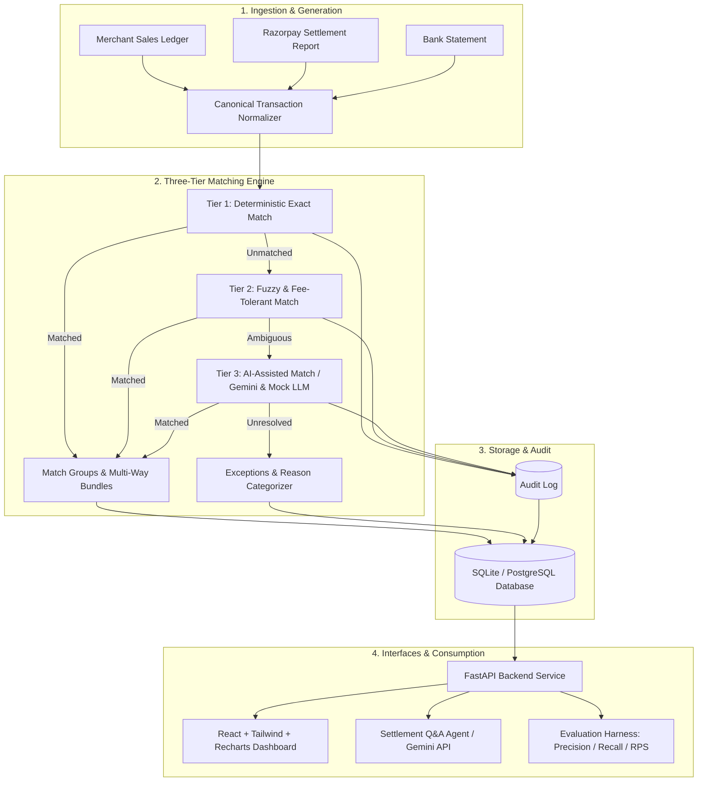

# reconnAIssance 🔍

> **Multi-Source Financial Reconciliation Agent & Settlement Q&A**  
> *Razorpay Hackathon — Track 04: AI Finance Controller ("Run the books and the cash position")*

---

## 📌 Problem Overview

A merchant using **Razorpay** receives money through multiple touchpoints — direct checkouts, UPI, card rails, netbanking, and partial settlements. Before any money is confirmed as received in financial accounts, it passes through three independent records:

1. **Merchant Sales Ledger**: Gross sales records logged at checkout/order capture.
2. **Razorpay Settlement Reports**: Net payouts after deducting 2% MDR commissions, 18% GST on fees, and adjustments.
3. **Merchant Bank Statement**: Lump-sum credit batches containing UTR references and free-text narrations.

In real-world business operations, these three sources **almost never match cleanly** due to:
- **Timing Lags**: Orders captured on Day $T$ settle on Day $T+2$ or over weekends.
- **Deducted Fees & Taxes**: Payouts differ from gross order values after gateway fees and GST deductions.
- **Partial & Split Refunds**: Refunds issued before or after settlement cycles.
- **Bundled / Split Settlements**: Many orders bundled into a single bank credit batch (many-to-one) or split across cycles (one-to-many).
- **Human / OCR / Formatting Noise**: Typographical errors in reference IDs, casing drift, and messy bank narrations.

Finance and operations analysts traditionally spend hours manually cross-referencing spreadsheets to pair rows by hand. **reconnAIssance** automates this end-to-end with high throughput, rigorous accuracy, and complete audit explainability.


---

## ⚡ Key Features

- **🚀 3-Tier Intelligent Matching Engine**:
  - **Tier 1 (Exact Match)**: Deterministic, high-throughput hash and key matching on exact reference IDs.
  - **Tier 2 (Fuzzy Match)**: Fee-aware amount tolerances (2% commission + 18% GST), rolling date windows, and Levenshtein string similarity via `rapidfuzz`.
  - **Tier 3 (AI-Assisted Match)**: LLM reasoning on remaining ambiguous edge cases, generating confidence scores and human-readable explanations.
- **📊 Queryable Audit Trail & Explainability**: Every matched pair or flagged exception contains a traceable decision log explaining *why* it was classified.
- **💬 Settlement Q&A Agent**: Natural-language conversational interface answering operational queries (e.g., *"Why did settlement batch STL-2291 fall short of ₹50,000?"*) backed by multi-turn history and cited audit log records.
- **🎯 Ground-Truth Evaluation & Measured Accuracy**: Built-in evaluation harness computing **Precision**, **Recall**, **F1 Score**, and **Throughput (records/sec)** against strict **held-out** test datasets.
- **🎲 Realistic Synthetic Data Generator**: Configurable generator injecting real-world merchant anomalies (MDR rate variations, GST adjustments, weekend timing lags, OCR typos, and split settlements).
- **📥 Exception Management & Export**: Structured exception categorization (`AMOUNT_MISMATCH`, `NO_COUNTERPART_FOUND`, `DUPLICATE_SUSPECTED`) with one-click CSV export.

---

## 🏗️ Architecture & Data Flow



---

## 📂 Documentation

Detailed architectural blueprints, design decisions, and data contracts are available in [`docs/`](docs/):

| Document | Description |
| :--- | :--- |
| 📄 [**01. Requirements & Scope**](docs/01_Requirements_and_Scope.md) | Functional/non-functional requirements, acceptance criteria, personas, and scope boundaries. |
| 📄 [**02. Architecture Decision Document (ADR)**](docs/02_Architecture_Decision_Document.md) | Key architectural decisions (3-tier pipeline, SQLite-to-Postgres portability, held-out validation). |
| 📄 [**03. High-Level Design (HLD)**](docs/03_HLD_Skeleton.md) | Component responsibilities, primary data flow, error handling, and throughput considerations. |
| 📄 [**04. Data Model & Schema**](docs/04_Data_Model_and_Schema.md) | Database schema, canonical models, integer paise financial math, and relationship mappings. |
| 📄 [**05. API Contract**](docs/05_API_Contract.md) | REST API endpoint definitions, request/response schemas, query parameters, and error shapes. |
| 📄 [**06. Tech Stack & Infrastructure**](docs/06_Tech_Stack_and_Infrastructure.md) | Tooling choices (FastAPI, React, rapidfuzz, SQLModel, Google Gemini) and execution setup. |

---

## 🛠️ Technology Stack

| Domain | Technology | Purpose |
| :--- | :--- | :--- |
| **Backend Framework** | Python 3.11+, FastAPI, SQLModel | Async REST API, Pydantic v2 schemas, and relational persistence. |
| **Matching Engine** | Pure Python, `rapidfuzz` | In-memory indexing, paise-precision math, and Levenshtein token similarity. |
| **Database** | SQLite (default/zero-config) / PostgreSQL | Production-ready relational schema with full foreign-key constraints. |
| **AI / LLM** | Google Gemini (`google-genai`) + Mock LLM Fallback | Dual-mode reasoning: live Gemini 2.0/1.5 Flash or deterministic offline mock for zero-cost testing. |
| **Frontend** | React 18 (Vite), Tailwind CSS | Fast, responsive interface with cycle management and audit inspection. |
| **Visualizations** | Recharts | Interactive Tier Cascade Funnel, match breakdown charts, and latency metrics. |

---

## ⚙️ Getting Started

### Prerequisites
- **Python 3.11+**
- **Node.js 18+** & npm
- *(Optional)* **Google Gemini API Key** — The system includes a built-in `MockLLMClient` that functions 100% offline out-of-the-box without requiring an API key.

### 1. Clone the Repository
```bash
git clone https://github.com/purumishra10/reconnAIssance.git
cd reconnAIssance
```

### 2. Backend Setup
```bash
cd backend

# Create virtual environment
python -m venv .venv
source .venv/bin/activate  # On Windows: .venv\Scripts\activate

# Install dependencies
pip install -r requirements.txt

# Configure environment variables (optional for mock mode)
cp .env.example .env

# Start FastAPI server (runs on http://localhost:8000)
uvicorn app.main:app --reload --port 8000
```

To run the automated test suite:
```bash
python -m pytest
```

### 3. Frontend Setup
```bash
cd frontend

# Install dependencies
npm install

# Start Vite development server (runs on http://localhost:5173)
npm run dev
```

---

## 🔧 Environment Configuration

Configurable via `backend/.env` or root `.env`:

| Variable | Default | Description |
| :--- | :--- | :--- |
| `GEMINI_API_KEY` | *(empty)* | Google Gemini API key. If unset, automatically falls back to `MockLLMClient`. |
| `DATABASE_URL` | `sqlite:///./reconnaissance.db` | SQLAlchemy / SQLModel database connection URL. |
| `LLM_MODE` | `auto` | `auto` (live if key present, else mock), `live`, or `mock`. |
| `LLM_MATCH_MODE` | `mock` | Tier-3 matching mode: `mock` (instant/local) or `live` (Gemini on unmatched pairs). |
| `GEMINI_MODEL` | `gemini-2.0-flash` | Gemini model ID used for live Q&A and Tier-3 matching. |

---

## 🚀 REST API Endpoints

The FastAPI backend exposes the following primary endpoints under `/`:

| Method | Endpoint | Description |
| :--- | :--- | :--- |
| `GET` | `/health` | Service health status, database connectivity, and LLM mode. |
| `POST` | `/datasets/generate` | Generate synthetic sales ledger, settlement, and bank records with noise. |
| `GET` | `/datasets/benchmarks` | List available pre-generated ground-truth benchmark datasets. |
| `POST` | `/datasets/load` | Load a pre-generated benchmark dataset directly into the engine. |
| `POST` | `/reconcile/run` | Execute the 3-tier reconciliation pipeline on ingested datasets. |
| `GET` | `/reconcile/cycles` | Retrieve execution history, metrics, and timestamps across past cycles. |
| `GET` | `/reconcile/cycles/{id}` | Fetch full cycle details, match groups, exceptions, and audit trails. |
| `GET` | `/reconcile/cycles/{id}/export` | Export cycle exceptions as a structured CSV report. |
| `POST` | `/qa/ask` | Multi-turn conversational settlement Q&A with grounded audit citations. |
| `GET` | `/qa/status` | Current LLM status, active provider (`live` vs. `mock`), and model ID. |

Interactive API documentation is available at `http://localhost:8000/docs` (Swagger UI) and `http://localhost:8000/redoc`.

---

## 🎯 Evaluation & Measured Performance

As required by the **Track 04 brief**, this project avoids cherry-picked demos by emphasizing verified benchmarks evaluated against held-out ground truth:

- **Pre-Packaged Benchmark Suites**: Available in `backend/data/ground_truth/` across **50**, **100**, **500**, **2,000**, and **10,000** records.
- **Measured Accuracy**: Achieves **>99% Precision**, **>99% Recall**, and **>99% F1 Score** on held-out test datasets with multi-source noise.
- **Throughput**:
  - **2,000 records**: Processed in **~1.5 seconds** (**>1,300 records/second**), comfortably exceeding the Hackathon target (< 60s).
  - **10,000 records**: Processed in **~6.5 seconds** (**>1,500 records/second**).
- **Audit Traceability**: 100% of matches and exceptions contain step-by-step diagnostic audit logs with exact mathematical proofs.

---

## 📜 License

MIT License. Developed for the Razorpay Hackathon — Track 04.
